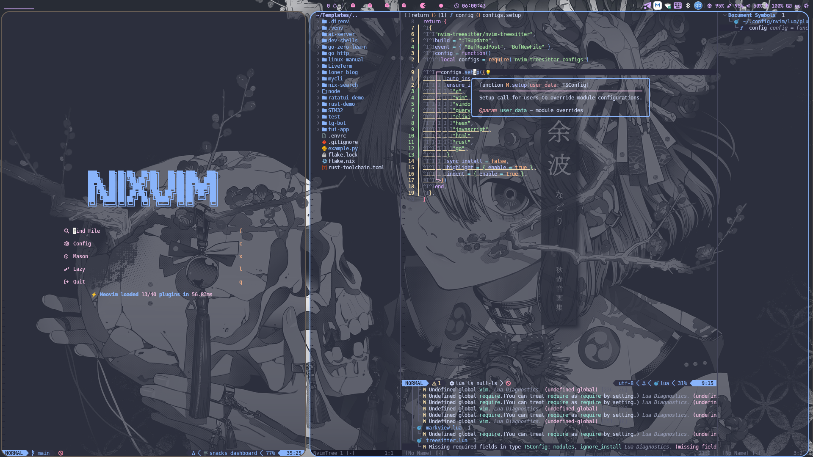

# 🧠 nvim-config

> A modern, modular Neovim configuration powered by [lazy.nvim],
> with full LSP support,
> tree-sitter syntax,
> Git integration,
> and beautiful UI — tailored for Nix and beyond.



## ✨ Features

- ⚙️ Modular plugin loading with `lazy.nvim`
- 🧠 LSP support (e.g. `nixd`, `lua_ls`)
- 🧹 Formatting via `nixfmt-rfc-style` and `none-ls`
- 🔍 Fuzzy finder, file explorer, git integration
- 🎨 Beautiful UI with Nerd Font and `catppuccin` colorscheme
- 📝 Snippets, completion, Markdown preview
- 📋 Session management and keybinding hints

## 🧰 Requirements

- [Neovim](https://neovim.io/) >= 0.9
- [`nixd`](https://github.com/nix-community/nixd)
- [`nixfmt-rfc-style`](https://github.com/nix-community/nixfmt)
- [Nerd Font](https://www.nerdfonts.com/)

## 🚀 Installation

```bash
git clone https://github.com/lonerOrz/nvim-config.git ~/.config/nvim
nvim
```

首次启动时，`lazy.nvim` 会自动安装并拉取配置中定义的所有插件。你可以使用以下命令检查健康状态：

```vim
:checkhealth
```

## 🔌 Plugin Categories

- **Plugin management**: `lazy.nvim`
- **UI**: `catppuccin`, `lualine`, `nvim-web-devicons`, `nui`, `neo-tree`, `which-key`
- **LSP & Formatting**: `nvim-lspconfig`, `nixd`, `none-ls`, `lazydev`
- **Completion & Snippets**: `nvim-cmp`, `LuaSnip`, `cmp_luasnip`
- **Fuzzy finding**: `telescope.nvim`
- **Git integration**: `lazygit.nvim`, `gitsigns.nvim`
- **Productivity**: `auto-session`, `markview.nvim`

## 🎹 Key Bindings

| Shortcut     | Description      |
| ------------ | ---------------- |
| `<leader>ff` | Find file        |
| `<leader>fg` | Live grep        |
| `<leader>fb` | Buffer list      |
| `<leader>ft` | Toggle file tree |
| `<leader>gs` | Launch Lazygit   |
| `<leader>ss` | Save session     |
| `<leader>sl` | Load session     |

完整快捷键可通过 `which-key` 弹出菜单查看。

## 📁 Project Structure

```txt
.
├── init.lua               # Entry point
├── lazy-lock.json         # Plugin lockfile
├── lua/
│   ├── colors/            # Theme & highlight config
│   ├── config/            # Core settings, lazy setup
│   ├── lang/              # LSP configurations
│   ├── plugins/           # Plugin modules
│   └── utils/             # Helper functions
```

## 📄 License

This project is licensed under the [MIT License](LICENSE).

## 🔗 Links

- GitHub: [https://github.com/lonerOrz/nvim-config](https://github.com/lonerOrz/nvim-config)
- Fonts: [https://www.nerdfonts.com](https://www.nerdfonts.com)
- Formatter: [nixfmt-rfc-style](https://github.com/nix-community/nixfmt)
- Colorscheme: [catppuccin/nvim](https://github.com/catppuccin/nvim)
