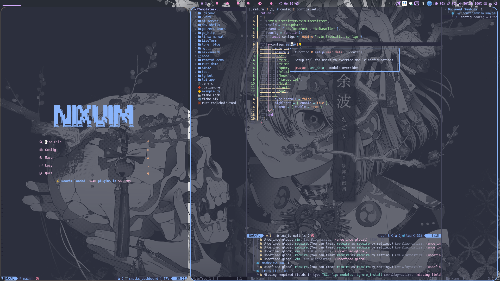

# 🧠 nvim-config

> A modern, modular Neovim configuration powered by [lazy.nvim],
> with full LSP support, Blink completion, Tree-sitter syntax,
> Snacks suite, and Yazi terminal file manager.



## ✨ Features

- ⚙️ Modular plugin loading with `lazy.nvim`
- 🧠 LSP support (`nixd`, `lua_ls`, `rust-analyzer`)
- 🧹 Formatting via `conform.nvim` (`prettier`, `taplo`, `sql-formatter`, LSP fallback)
- 🔍 Fast picker & file management (`snacks.picker`, `fzf-lua`, `yazi.nvim`)
- 🎨 Beautiful UI with Nerd Font, `noice.nvim`, and `catppuccin` colorscheme
- 📝 Modern completion powered by `blink.cmp` & Windsurf AI (Codeium)
- 📋 Session management (`auto-session`) and smart Keybinding hints (`which-key`)

## 🧰 Requirements

- [Neovim](https://neovim.io/) >= 0.10
- [`nixd`](https://github.com/nix-community/nixd) / [`nixfmt`](https://github.com/nix-community/nixfmt)
- [Yazi](https://github.com/sxyazi/yazi) & [Lazygit](https://github.com/jesseduffield/lazygit)
- [Nerd Font](https://www.nerdfonts.com/)

## 🚀 Installation

```bash
git clone https://github.com/lonerOrz/nvim-config.git ~/.config/nvim
nvim
```

Upon initial launch, `lazy.nvim` will automatically download and install all configured plugins. You can inspect system health using:

```vim
:checkhealth
```

## 🔌 Plugin Categories

- **Plugin management**: `lazy.nvim`
- **UI & Dashboard**: `catppuccin`, `lualine`, `barbar.nvim`, `noice.nvim`, `snacks.nvim`, `which-key.nvim`
- **LSP & Formatting**: `nvim-lspconfig`, `mason-org/mason.nvim`, `lspsaga.nvim`, `conform.nvim`, `lazydev.nvim`, `trouble.nvim`
- **Completion & AI**: `blink.cmp`, `windsurf.nvim`
- **Fuzzy Finding & Tools**: `snacks.picker`, `fzf-lua`, `yazi.nvim`
- **Git & Diff**: `gitsigns.nvim`, `snacks.lazygit`
- **Productivity**: `auto-session`, `markview.nvim`, `flash.nvim`, `compile-mode.nvim`

## 🎹 Key Bindings Summary

Keymaps follow a **prefix semantics + mnemonic suffix** convention:

| Prefix      | Scope                   |
| ----------- | ----------------------- |
| `<leader>s` | Search & Find           |
| `<leader>c` | Code (LSP actions)      |
| `<leader>j` | Jump & Motion (`flash`) |
| `<leader>b` | Buffers                 |
| `<leader>t` | Toggles                 |
| `<leader>l` | Git / Lazygit           |
| `<leader>p` | Sessions                |
| `<leader>y` | Yazi file manager       |
| `<leader>w` | LSP workspace folders   |
| `<leader>n` | Notifications           |
| `<leader>u` | Utilities               |

Full keymaps are interactively available via `which-key` (press `<leader>` and wait briefly).

## 📁 Project Structure

```txt
.
├── init.lua               # Entry point & environment setup
├── lazy-lock.json         # Plugin lockfile
├── lua/
│   ├── theme/               # Theme & highlight config
│   ├── config/            # Core settings, keymaps, lazy setup
│   ├── lang/              # LSP & language-specific configurations
│   └── plugins/           # Plugin modules
```

## 📄 License

This project is licensed under the [MIT License](LICENSE).

## 🔗 Links

- GitHub: [https://github.com/lonerOrz/nvim-config](https://github.com/lonerOrz/nvim-config)
- Fonts: [https://www.nerdfonts.com](https://www.nerdfonts.com)
- Colorscheme: [catppuccin/nvim](https://github.com/catppuccin/nvim)
